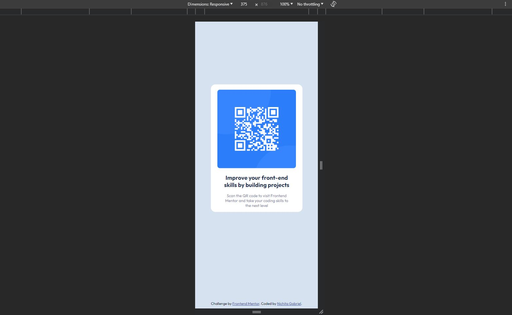

# QR-code-component
I had to build out a QR code component and get it looking as close to the design as possible.

# Frontend Mentor - QR code component solution

This is a solution to the [QR code component challenge on Frontend Mentor](https://www.frontendmentor.io/challenges/qr-code-component-iux_sIO_H).

## Table of contents

- [Overview](#overview)
  - [Screenshot](#screenshot)
  - [Links](#links)
- [My process](#my-process)
  - [Built with](#built-with)
- [Author](#author)

## Overview

### Screenshot
Desktop version

Mobile version

### Links

- Solution URL: [GitHub Repository](https://github.com/NichitaGabriel/QR-code-componentcom)
- Live Site URL: [GitHub Pages](https://nichitagabriel.github.io/QR-code-component/)

## My process

### Built with

- HTML5 
- CSS 
- Mobile-first workflow
- Visual Studio Code

## Author

- Website - [Nichita Gabriel](https://github.com/NichitaGabriel)
- Frontend Mentor - [@nichitagabriel](https://www.frontendmentor.io/profile/NichitaGabriel)
